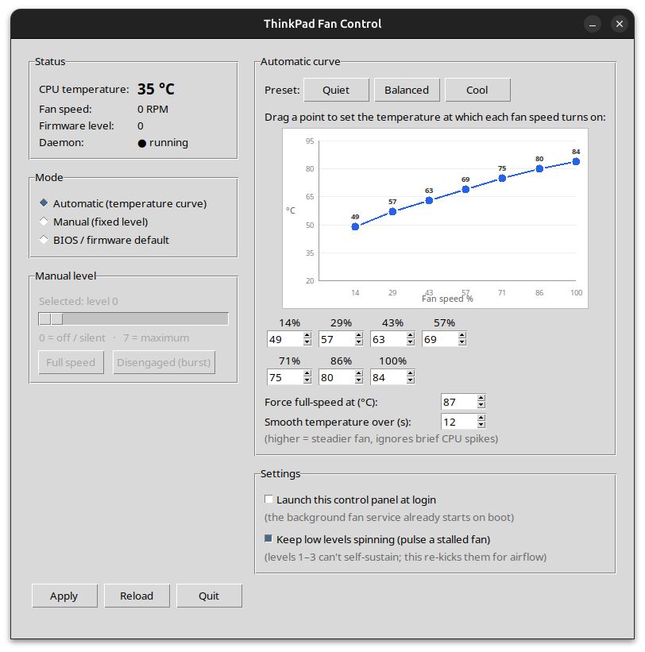

# ThinkPad Fan Control

Automatic fan-speed control for **ThinkPad laptops on Linux**, with a desktop GUI.
It gives you what the firmware / GNOME power profiles don't: **automatic
temperature-based control across all 8 fan levels**, an editable curve you can
drag on a graph, and precise manual override.

Works on ThinkPads whose fan is controlled by the **`thinkpad_acpi`** driver
(`/proc/acpi/ibm/fan`) — i.e. the large majority of ThinkPads on Linux.
Developed and tested on a **ThinkPad L490 (Ubuntu 24.04)**.



## How it works

- **`thinkpad-fand`** — a small root daemon (systemd service) that is the *only*
  writer to `/proc/acpi/ibm/fan`. It runs the temperature curve and all safety.
- **`thinkpad-fan-gui`** — a Tkinter desktop app (runs as your normal user) to
  watch temperature/RPM and choose the mode and curve.

The two communicate only through a JSON file (`/etc/thinkpad-fan/config.json`),
so the GUI never needs root — clean and Wayland-friendly. CPU temperature is read
from `coretemp` (Intel), `k10temp` (AMD), or the ThinkPad sensor, so it works on
both Intel and AMD ThinkPads.

## Modes

| Mode | Behaviour |
|------|-----------|
| **Automatic** | Picks fan level 0–7 from CPU temperature using an editable curve, with hysteresis so it doesn't oscillate. Edit it on an **interactive graph** (Y = temperature, X = fan speed %) by dragging points, or with the numeric boxes / presets — they stay in sync. |
| **Manual** | Holds a fixed level you choose (slider 0–7, plus *Full speed* / *Disengaged*). |
| **BIOS** | Hands control back to the firmware (`level auto`). |

### Features

- **Interactive curve graph** — drag the dots to set the temperature at which
  each fan speed turns on; points are kept monotonic automatically.
- **Temperature smoothing** — the curve reacts to an averaged temperature
  (default 12 s) so brief CPU turbo spikes don't surge the fan on and off.
- **Stall re-kick** *(experimental)* — on some ThinkPads the lowest fan levels
  (≈1–3) can't keep the fan spinning: it spins up, then stalls to 0 RPM. When
  enabled, the daemon re-issues a stalled level periodically to pulse some
  airflow. Levels that *do* sustain (RPM > 0) are never re-kicked, so higher
  speeds stay perfectly smooth. Tested on the L490; behaviour varies by model.
- **Launch at login** — optional XDG autostart for the control panel.
- **App icon** for the menu/dock launcher and window.

## Safety (built in, cannot be disabled)

- **Critical-temperature override** — above your configured limit (default 87 °C,
  hard cap 90 °C) the fan is forced to full speed regardless of mode. This is what
  makes the user-editable config safe.
- **Hardware watchdog** — re-armed every loop. If the daemon ever crashes, the
  firmware resumes automatic cooling within ~15 s; the fan can't get stuck off.
- **Read-back / re-assert** — the daemon reads the firmware's actual level back
  and only rewrites when it has drifted, so it never thrashes the fan.
- **Graceful stop** — stopping the service restores firmware `auto`.
- The daemon validates and clamps everything it reads from the config.

## Install

### Option A — Debian package (Ubuntu / Debian / Mint / Pop!_OS)

Download `thinkpad-fan-control_1.0.0_all.deb` from the
[**Releases**](https://github.com/Swmarakis/thinkpad-fan-control/releases/latest)
page, then:

```bash
sudo apt install ./thinkpad-fan-control_1.0.0_all.deb
```

### Option B — from source

```bash
git clone https://github.com/Swmarakis/thinkpad-fan-control.git
cd thinkpad-fan-control
sudo ./install.sh
```

Either way, the installer enables fan control (`thinkpad_acpi fan_control=1`),
starts the background service, and adds a **“ThinkPad Fan Control”** launcher.
If `/proc/acpi/ibm/fan` was just made writable, a reboot may be needed once.

## Useful commands

```bash
systemctl status thinkpad-fand      # service state
journalctl -u thinkpad-fand -f      # live log of the levels it sets
sudo thinkpad-fand --dry-run        # print decisions without touching the fan
```

## Uninstall

```bash
sudo apt remove thinkpad-fan-control     # if installed via .deb
# or, if installed from source:
sudo ./uninstall.sh
```

## Notes

- *Disengaged* removes the fan's speed cap for maximum airflow — for short
  bursts, not sustained use.
- Fan levels are firmware-defined and **not linear**; on some models the lowest
  levels barely spin the fan. For steady airflow use a level that actually
  sustains (often ≈4+), or enable the stall re-kick for intermittent airflow.

## Repository layout

```
src/        the daemon (thinkpad-fand) and GUI (thinkpad-fan-gui)
data/       files the installer ships: systemd unit, .desktop, default config, icons
packaging/  build-deb.sh (creates the release .deb) and the icon generator
install.sh  / uninstall.sh   install from source
docs/       screenshot
```

To produce the `.deb` for a release: `packaging/build-deb.sh`
(output: `build/thinkpad-fan-control_<ver>_all.deb`).

## License

MIT — see [LICENSE](LICENSE).
